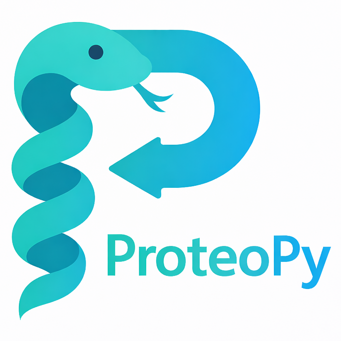

# ProteoPy

[](https://github.com/UKHD-NP/proteopy/blob/main/LICENSE)
[](https://www.python.org/)
[](https://pypi.org/project/proteopy/)
[](https://pepy.tech/project/proteopy)
[](https://pepy.tech/project/proteopy)
[](https://github.com/UKHD-NP/proteopy/actions/workflows/format-code_perform-tests_on_push-pr.yaml)
[](https://proteopy.readthedocs.io/en/latest/)
[](https://codecov.io/gh/UKHD-NP/proteopy)

<table>
<tr>
<td width="120">

</td>
<td>

**ProteoPy** is a Python library that brings quantitative proteomics into the
[AnnData](https://anndata.readthedocs.io/) ecosystem. It provides a unified and
extensible framework for protein- and peptide-level analysis — from data import
through quality control, preprocessing, and differential abundance testing —
while storing all data and metadata in a single portable object.

**Official documentation:**
[proteopy.readthedocs.io](https://proteopy.readthedocs.io/)

</td>
</tr>
</table>

## Why ProteoPy?

Mass spectrometry-based proteomics lacks a standardized data structure in
python comparable to what AnnData provides for single-cell transcriptomics.
Existing tools rely on distinct formats and scripting environments, forcing
researchers to learn multiple ecosystems and making multi-omics integration
cumbersome. ProteoPy bridges this gap by adopting the proven AnnData framework,
enabling:

- **Familiar workflows** for users of scanpy, squidpy, and the broader
  single-cell python ecosystem
- **Reproducible analyses** with all processing steps tracked in a single
  object
- **Seamless multi-omics integration** via direct compatibility with
  [MuData](https://mudata.readthedocs.io/) and
  [MUON](https://muon.readthedocs.io/)
- **Direct [scanpy](https://scanpy.readthedocs.io/) integration** for
  dimensionality reduction, clustering and visualization as well as single-cell
  analysis compatibility.

## Key Features

- **Flexible data import** from DIA-NN, MaxQuant, and generic tabular formats
- **Quality control & filtering** with completeness metrics, CV analysis, and
  contaminant removal
- **Preprocessing** including normalization, batch correction (via scanpy),
  and missing-value imputation
- **Peptide-level analysis** with overlapping peptide grouping, peptide-to-
  protein quantification, and per-protein peptide intensity visualization
- **Differential abundance analysis** with t-test, Welch's test and
  multiple testing correction
- **Proteoform inference** via a reimplementation of the
  [COPF algorithm](https://doi.org/10.1038/s41467-021-24030-x) for detecting
  functional proteoform groups from peptide-level data
- **Publication-ready visualizations** for QC, exploratory analysis, and
  statistical results

## Installation

ProteoPy requires Python 3.10 or later. We recommend installing ProteoPy in a
dedicated virtual environment:

```bash
# Using venv
python -m venv proteopy-env
source proteopy-env/bin/activate  # Linux/macOS
# proteopy-env\Scripts\activate   # Windows
pip install ipykernel
python -m ipykernel install --user --name=proteopy-env

# Using conda
conda create -n proteopy-env "python>=3.10"
conda activate proteopy-env
pip install ipykernel
python -m ipykernel install --user --name=proteopy-env

# Using uv
uv venv proteopy-env
source proteopy-env/bin/activate
uv pip install ipykernel
python -m ipykernel install --user --name=proteopy-env
```

Then install ProteoPy:

```bash
pip install proteopy
```

For notebook-centric workflows, the `[usage]` extra installs ipykernel,
jupyterlab, and scanpy (for extended analysis functionality such as batch
control, PCA, UMAP and more):

```bash
pip install proteopy[usage]
```

To install the development version from GitHub:

```bash
pip install git+https://github.com/UKHD-NP/proteopy.git
```

## Documentation

Full documentation, including API reference and tutorials, is available at
[proteopy.readthedocs.io](https://proteopy.readthedocs.io/).

### Tutorials

- **Protein-level analysis** — Complete workflow from data import to
  differential abundance analysis
  ([notebook](https://github.com/UKHD-NP/proteopy/blob/main/docs/tutorials/workflow_protein-analysis_karayel-2020.ipynb))
- **Proteoform inference** — Detecting functional proteoform groups with COPF
  ([notebook](https://github.com/UKHD-NP/proteopy/blob/main/docs/tutorials/workflow_proteoform-inference_bludau-2021.ipynb))

## Quick Start

```python
import proteopy as pr
import scanpy as sc

# Load example dataset
adata = pr.datasets.karayel_2020()

# Quality control: filter by completeness
pr.pp.filter_var_completeness(adata, min_fraction=0.8, zero_to_na=True)

# Preprocessing
pr.pp.normalize_median(adata, log_space=True)
pr.pp.impute_downshift(adata, downshift=1.8, width=0.3)

# Differential abundance analysis
pr.tl.differential_abundance(adata, method="ttest_two_sample", group_by="cell_type")

# Visualize results
pr.pl.volcano_plot(adata, varm_slot="ttest_two_sample;cell_type;Ortho_vs_rest")

# Seamless scanpy integration for dimensionality reduction
sc.tl.pca(adata)
sc.pl.pca(adata, color="cell_type")
```

## Support

- **Questions & discussions:**
  [GitHub Discussions](https://github.com/UKHD-NP/proteopy/discussions)
- **Bug reports & feature requests:**
  [GitHub Issues](https://github.com/UKHD-NP/proteopy/issues)
- **Maintainer:** [@idf-io](https://github.com/idf-io) (Ian Dirk Fichtner)
- See [HISTORY.md](HISTORY.md) for the changelog.

## Citing ProteoPy

If you use ProteoPy in your research, please cite:

> Fichtner ID, Sahm F, Gerstung M, Bludau I. ProteoPy: an AnnData-based
> framework for integrated proteomics analysis. *UNPUBLISHED* (2025).

```bibtex
@article{fichtner2025proteopy,
  title={ProteoPy: an AnnData-based framework for integrated proteomics analysis},
  author={Fichtner, Ian Dirk and Sahm, Felix and Gerstung, Moritz and Bludau, Isabell},
  journal={UNPUBLISHED},
  year={2025}
}
```

If you use the COPF proteoform inference functionality, please also cite:

> Bludau I, et al. Systematic detection of functional proteoform groups from
> bottom-up proteomic datasets. *Nat. Commun.* 12, 3810 (2021).
> [doi:10.1038/s41467-021-24030-x](https://doi.org/10.1038/s41467-021-24030-x)

## License

ProteoPy was developed by the Bludau Lab at the Neuropathology Department
Heidelberg and is freely available under the Apache 2.0 license. External
Python dependencies (see [pyproject.toml](pyproject.toml) file) have their own
licenses, which can be consulted on their respective websites.
